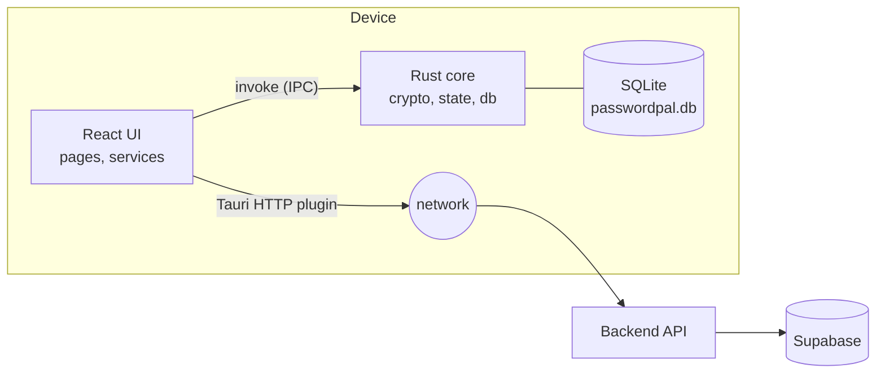
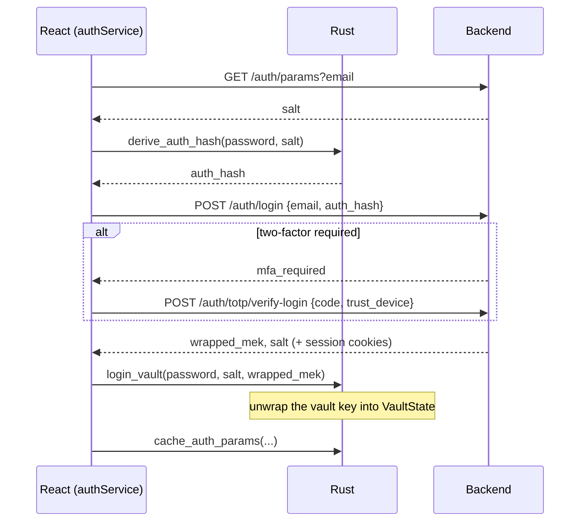

# Architecture

PasswordPal is a Tauri v2 desktop app. A React/TypeScript UI runs in the system webview; a Rust core holds the keys, does all cryptography and owns the local database. They talk through Tauri commands (IPC). The UI talks to the [backend](https://github.com/USER1043/PasswordPal_Backend) over HTTPS using Tauri's native HTTP client.



## Why the split

- **Keys stay in Rust.** The unlocked vault key lives in `VaultState` (`src-tauri/src/state.rs`) as a `Zeroizing` buffer. The UI never sees it. Encryption and decryption happen in Rust and only plaintext entries cross the IPC boundary, on demand.
- **No browser CORS.** Requests go through `@tauri-apps/plugin-http`, which runs in Rust. A capability restricts it to a single host: the backend URL given at build time (see [BUILD_AND_RELEASE.md](BUILD_AND_RELEASE.md)).
- **Offline by default.** Entries are written to local SQLite first; sync is a background step.

## React side (`src/`)

| Area | Files | Role |
| :--- | :--- | :--- |
| App shell | `App.tsx`, `components/AppLayout.tsx`, `Sidebar.tsx` | View switching (no router: a `currentView` state), auto-lock timer, clipboard clearing, connectivity polling, reaction to session revocation |
| Pages | `pages/*.tsx` | Login, Register, Recovery, Vault, Security dashboard, Generator, Audit log, Settings |
| Services | `services/*.ts` | The only code that calls Tauri commands or the API. `authService` (login, register, recovery, change password, offline login), `vaultService` (save, delete, fetch, sync), `totpService`, `breachService`, `deviceService`, `networkProbe` |
| HTTP | `api/axiosClient.ts` | Axios-like wrapper over Tauri fetch: base URL, `X-Device-Id` header, cookie-based session, automatic `/auth/refresh` on 401, `session-revoked` event |
| State | `context/NotificationContext.tsx`, `ConflictContext.tsx` | Toasts and the sync-conflict dialog |

## Rust side (`src-tauri/src/`)

| File | Role |
| :--- | :--- |
| `crypto.rs` | Argon2id, key derivation, recovery key pair and signature. See [CRYPTO.md](CRYPTO.md) |
| `state.rs` | `VaultState`: holds the key while unlocked; `lock()` drops and zeroizes it |
| `models.rs` | Shared types, e.g. `VaultEntry` |
| `db.rs` | SQLite access and its commands |
| `commands/auth.rs` | Register, login, derive auth hash, change password, recovery |
| `commands/entry.rs` | `encrypt_entry` / `decrypt_entry` (AES-256-GCM) |
| `commands/vault.rs` | `lock_vault` |
| `lib.rs` | Registers commands and opens the database |

### Tauri commands

| Command | Purpose |
| :--- | :--- |
| `register_vault`, `login_vault`, `derive_auth_hash` | Key derivation for registration, login and re-authentication |
| `change_password_optimization` | Re-wrap the vault key under a new password (the vault data is untouched) |
| `recover_vault`, `recovery_public_key_command`, `sign_recovery_request_command` | Recovery key handling and the signature sent to `/auth/recover` |
| `encrypt_entry`, `decrypt_entry` | Entry encryption (used for conflict display) |
| `lock_vault` | Wipe the key from memory |
| `upsert_local_vault_record`, `fetch_vault_local`, `mark_deleted_local`, `mark_synced_local`, `get_pending_sync_queue` | Local vault rows and the pending-sync queue |
| `cache_auth_params`, `get_cached_auth_params`, `clear_local_auth_cache` | Cached login material for offline login |
| `get_local_identity` | Stable per-install device id and name |

### Local database

`passwordpal.db` in the app data directory:

| Table | Contents |
| :--- | :--- |
| `local_vault` | `id`, `user_id`, `encrypted_data`, `nonce`, `version`, `sync_status`, `record_type`. Rows are ciphertext |
| `auth_cache` | Per email: `salt`, `wrapped_mek`, `local_password_hash` (used for offline login and local re-authentication) |
| `local_config` | Device id and name; survives logout so the device keeps its identity |

`sync_status` is one of `synced`, `pending_insert`, `pending_update`, `pending_delete`.

## Flows

### Login



If the server cannot be reached (`networkProbe`), `authService` falls back to the cached `auth_cache` row: Rust unwraps the key and the app compares the derived hash to the cached one.

### Saving and syncing an entry

```mermaid
sequenceDiagram
    participant UI as vaultService
    participant R as Rust + SQLite
    participant S as Backend
    UI->>R: upsert_local_vault_record(entry, pending_insert/update)
    Note over R: encrypt, write row, return
    UI->>UI: syncOfflineVault() (background)
    UI->>R: get_pending_sync_queue
    loop each pending row
        UI->>S: POST /api/vault (or DELETE /api/vault/:id)
        alt ok
            UI->>R: mark_synced_local(id, version)
        else 409 version conflict
            UI->>UI: show ConflictResolver, user picks local or server
        else network error
            UI->>UI: stop; retry on next change or reconnect
        end
    end
```

Reading the vault (`fetchVault`) pushes pending changes, pulls the whole vault with `GET /api/vault`, upserts each record locally, and then decrypts from SQLite. The backend also offers a delta endpoint (`/api/vault/sync`) that the app does not use yet (see [ROADMAP.md](ROADMAP.md)).

### Connectivity

`App.tsx` probes `GET /health` every 10 seconds (`networkProbe.ts`, 3 s timeout, `204` means online) and broadcasts `network-status`. When the connection returns, it triggers a sync.

### Session handling

- `axiosClient` retries a request once after a `401` by calling `POST /auth/refresh`; concurrent requests wait for the same refresh.
- If refresh answers `401` (expired, or the device was revoked or blocked), the client dispatches `session-revoked`. `App.tsx` returns to the login screen.
- **Auto-lock:** after 15 minutes without input the key is wiped (`lock_vault`) and the unlock screen asks for the master password. Unlocking re-derives the key from the cached `wrapped_mek`.
- **Logout** calls `POST /auth/logout`, clears session state, runs registered callbacks that blank sensitive component state, and wipes the key (`lock_vault`). The local SQLite database is kept on purpose so the user can still log in offline later; `clear_local_auth_cache` exists to remove it but is not called on logout.

### Registration and recovery

At registration Rust generates the salt and a random vault key (MEK), wraps it and returns the values to send. The MEK is also shown once as the **recovery key**. The app sends an Ed25519 public key derived from it so the server can later verify a recovery signature. To recover, the user enters the recovery key; Rust signs the server's challenge and re-wraps the MEK under a new password. Details in [CRYPTO.md](CRYPTO.md).

## Testing layout

- UI and services: Vitest with jsdom; Tauri `invoke` and the HTTP plugin are mocked in `src/tests/setup.ts`.
- Rust: logic functions (`*_logic`) are tested without a Tauri runtime in `src-tauri/tests/`; `backend_scope_tests.rs` covers the build-time URL handling.
