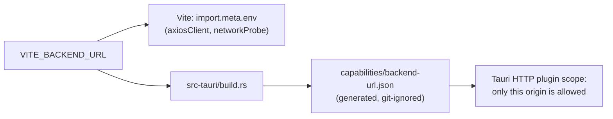

# Build and release

## Configuration

The app has one build-time setting.

| Variable | Default | Purpose |
| :--- | :--- | :--- |
| `VITE_BACKEND_URL` | `http://localhost:3000` | Backend base URL for the UI **and** the only host the app may call |

It is read from the process environment, then `.env.local`, then `.env` (the same order Vite uses). See `.env.example`. `.env`, `.env.local` and other `*.local` files are git-ignored; never commit real values.

### How the URL is applied



- The UI uses the value as its API base URL.
- `build.rs` (with `build_support/backend_scope.rs`) validates the URL and writes `src-tauri/capabilities/backend-url.json`, which grants the HTTP plugin access to that one origin. `capabilities/default.json` deliberately grants no HTTP access on its own.
- Requests to any other host fail with "url not allowed on the configured scope". If you see that error, the build was made with a different `VITE_BACKEND_URL` than the one you are calling. Rebuild after changing the value (restart `npm run tauri dev`).
- A release build without the variable falls back to localhost and prints a cargo warning.

`src-tauri/tests/backend_scope_tests.rs` covers the URL parsing and the generated capability.

## Local builds

```bash
npm run tauri dev                                              # development
VITE_BACKEND_URL=https://api.example.com npm run tauri build   # installers
```

Installers appear under `src-tauri/target/release/bundle/` (for example `.deb`, `.AppImage`, `.dmg`, `.msi`, `.exe`, depending on your OS).

## Checks before a pull request

```bash
npm run test:all   # tsc --noEmit, eslint, vitest, cargo fmt --check, clippy -D warnings, cargo test
```

## CI/CD (`.github/workflows/ci-cd.yml`)

| Job | Runs on | What it does |
| :--- | :--- | :--- |
| React Unit Tests & Lint | Pull requests | `tsc --noEmit`, ESLint, Vitest, Vite build (with `VITE_BACKEND_URL` from the secret) |
| Rust Crypto Tests | Pull requests | `cargo fmt --check`, `clippy -D warnings`, `cargo test --all` |
| Release Please | Pushes to `main` | Opens or updates the release pull request; creates a GitHub release when it is merged |
| Build Tauri | After a release is created | Builds Linux, Windows and macOS bundles with `tauri-action`, attaches them to the release and uploads them as artifacts |
| Notify on failure | Failed test jobs | Prints a failure summary |

Pull requests that only change Markdown files or `docs/` do not trigger the workflow (`paths-ignore`).

### Repository secrets

| Secret | Used for |
| :--- | :--- |
| `VITE_BACKEND_URL` | Backend URL baked into builds. The release build fails early if it is missing |
| `TAURI_SIGNING_PRIVATE_KEY`, `TAURI_SIGNING_PRIVATE_KEY_PASSWORD` | Signing update bundles |
| `GITHUB_TOKEN` | Provided by GitHub |

## Releases

Versioning is automated with [release-please](https://github.com/googleapis/release-please) from Conventional Commit messages (`release-please-config.json`).

1. Merge pull requests into `main` using conventional commit titles/commits.
2. release-please keeps a "release" pull request up to date with the next version and changelog.
3. Merging that pull request tags the release and updates the version in `package.json`, `src-tauri/tauri.conf.json` and `src-tauri/Cargo.toml`.
4. The Build Tauri job builds the installers for each OS and attaches them to the GitHub release.

| Commit | Release |
| :--- | :--- |
| `fix:` | patch |
| `feat:` | minor |
| `feat!:` or a `BREAKING CHANGE:` footer | major |
| `docs:`, `test:`, `chore:`, `refactor:`, `style:` | none by themselves |

`CHANGELOG.md` and the version fields are generated. Do not edit them by hand. See also [RELEASE.md](../RELEASE.md).
