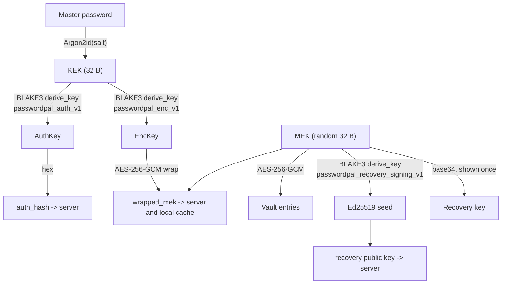

# Cryptography

All key handling is in Rust (`src-tauri/src/crypto.rs`, `src-tauri/src/commands/`). The server-side view of the same design is in the backend's `docs/SECURITY_MODEL.md`.

## Goals

- The server can never decrypt a vault or learn the master password.
- Changing the master password does not re-encrypt the vault.
- A forgotten master password can be reset with a recovery key, without the server being able to use that key.
- Keys exist in memory only while the vault is unlocked and are zeroized afterwards.

## Key hierarchy



| Name | Derivation | Lifetime |
| :--- | :--- | :--- |
| Salt | 16 random bytes, per account | Stored on the server and locally |
| KEK | Argon2id(password, salt), 32 bytes | Computed per login/unlock, dropped after use |
| AuthKey | BLAKE3 `derive_key("passwordpal_auth_v1", KEK)` | Hex-encoded as `auth_hash` and sent to the server, which hashes it again |
| EncKey | BLAKE3 `derive_key("passwordpal_enc_v1", KEK)` | Only wraps and unwraps the MEK |
| MEK | 32 random bytes from the OS CSPRNG, generated once at registration | Encrypts all entries; held in `VaultState` while unlocked |
| Recovery key | Base64 of the MEK | Shown once at registration; never sent anywhere |

AuthKey and EncKey are independent outputs of a one-way function, so knowing the `auth_hash` the server stores does not reveal the key that unwraps the MEK.

## Parameters and formats

- **Argon2id**: version 0x13, memory 64 MiB (65536 KiB), 3 iterations, 4 lanes, 32-byte output (`get_argon2_params`). The same parameters are used everywhere.
- **AES-256-GCM** for both wrapping and entries, with a fresh random 12-byte nonce per encryption.
- **`wrapped_mek`** = base64(`nonce (12 B)` ‖ `ciphertext + GCM tag`).
- **Entry blob** = base64(`nonce (12 B)` ‖ `ciphertext + GCM tag`) of the JSON-serialised `VaultEntry` (`name`, `username`, `folder_name`, `website_url`, `tags`, `password`, `notes`). The local database and the server store the nonce and ciphertext as separate columns.
- A wrong password fails the GCM tag check when unwrapping, which is how a wrong master password is detected.

## Flows

**Register** (`register_vault`): generate salt and MEK → derive KEK → derive AuthKey/EncKey → wrap the MEK with EncKey → return `salt`, `wrapped_mek`, `auth_hash` and the recovery key. The MEK is placed in `VaultState` so the new vault is immediately unlocked. The UI also asks Rust for the recovery public key (`recovery_public_key_command`) to send at registration.

**Login / unlock** (`derive_auth_hash`, `login_vault`): derive the KEK from the entered password and the account salt; send `auth_hash` to authenticate; unwrap `wrapped_mek` with EncKey; store the MEK in `VaultState`. Auto-lock and logout call `lock_vault`, which drops and zeroizes it.

**Change password** (`change_password_optimization`): unwrap the MEK with the old password's EncKey and wrap it again with the new password's EncKey. Only the wrapper changes, so the cost does not depend on vault size. The app sends the new `wrapped_mek` and `auth_hash` plus the current `auth_hash` to the server, which signs out other devices.

**Recovery** (`recover_vault`, `sign_recovery_request_command`):

1. The user enters the recovery key (the base64 MEK, must decode to 32 bytes).
2. The app asks the server for a one-time challenge (`POST /auth/recover/challenge`).
3. Rust derives the Ed25519 key pair from the MEK and re-wraps the same MEK under a new password and new salt.
4. Rust signs a message that binds the challenge to the new credentials, and the app sends the signature with the new values (`POST /auth/recover`).

Only the recovery public key was ever sent to the server (at registration), so a database leak does not give an attacker the ability to sign.

### Recovery signature format

```
message   = "passwordpal-recovery-v1\n" ‖ for each of
            [challenge, new_salt, new_wrapped_mek, new_auth_hash]:
              <byte length of the field in UTF-8>":"<field>"\n"
signature = Ed25519(seed, message)        // 64 bytes, sent as 128 hex chars
seed      = BLAKE3.derive_key("passwordpal_recovery_signing_v1", MEK)
public    = Ed25519 public key of seed    // 32 bytes, sent as 64 hex chars
```

The length prefixes make the encoding unambiguous, so a signature for one set of fields cannot be reused for another. `build_recovery_message` must stay byte-identical to the backend's `buildRecoveryMessage` (`utils/recoverySignature.js`). The backend has a test that verifies a signature produced by this code, and `src-tauri/tests/auth_tests.rs` covers the Rust side.

## Memory handling

- Keys and passwords in Rust are wrapped in `zeroize::Zeroizing` so they are overwritten when dropped.
- Argon2id runs on a blocking thread (`run_blocking`) so the UI stays responsive.
- The password string crosses IPC once per operation. The UI should clear it from component state after use (`authService` registers callbacks that blank sensitive fields on logout).
- The JavaScript side cannot guarantee that strings are wiped, which is why keys never enter it.

## Local storage

Entries are stored as ciphertext. `auth_cache` keeps the salt, `wrapped_mek` and the derived `auth_hash` (column `local_password_hash`) to support offline login and local re-authentication. Anyone who copies `passwordpal.db` can attempt offline guessing against `wrapped_mek`, so the strength of the master password and full-disk encryption matter. Removing the cached `auth_hash` in favour of relying on a successful MEK unwrap is on the [roadmap](ROADMAP.md).

## Changing cryptography

Changes here are security-sensitive and affect stored data and the backend. If you change a parameter, context string or format:

- add a version marker or migration so existing vaults still open,
- update the matching backend verifier and its known-answer test,
- add Rust tests for round trips and tampering (wrong key, modified ciphertext), and
- describe the change and its compatibility impact in the pull request.
